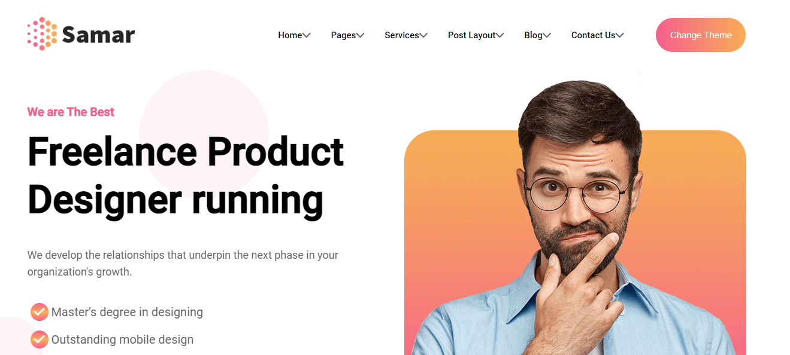

  
  

    <a href="https://my-project-samar.vercel.app/">View Demo</a>
    ·
    <a href="https://cybersamar.vercel.app/">Template</a>
  

 

  
  
Page

## Third Party plugin used except for HTML and CSS

- [Amimate](https://animate.style/)
- [Wow](https://wowjs.uk/)
- [Swiper](https://swiperjs.com/)
- [Lightgallery](https://www.lightgalleryjs.com/)
- [Counter-up](https://github.com/bfintal/Counter-Up)

## Todo

- Create a website based on a template.
- Add dark theme and responsive web.
